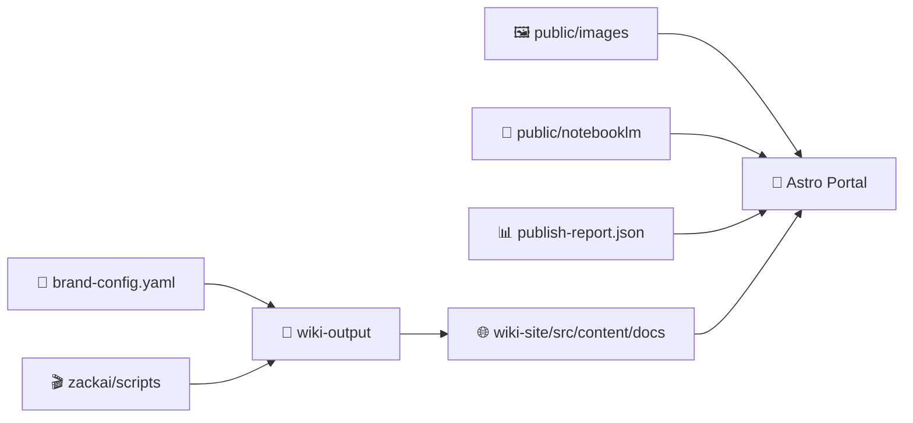

<div align="center">


<!-- readme-gen:start:badges -->


<p align="center">
  
</p>

<!-- readme-gen:end:badges -->

</div>

> ZackAI’s current **beta-update** launch portal — a branded Astro site that packages the latest product narrative, visual system, and NotebookLM research outputs into one reviewable repository.

This repo is the **published brand portal artifact**, not the Brandmint engine itself. It contains the Astro app, generated wiki source, selected brand config, and the NotebookLM-backed research/media assets that power the current ZackAI launch experience.


## Why this repo exists

Instead of shipping a raw folder dump, this repository captures the **current ZackAI beta-update portal** in a form that can be reviewed, versioned, shared, and evolved independently from the generation engine.

### What’s inside

<table>
<tr>
<td width="50%" valign="top">

### 🧸 Branded launch portal
An Astro site with a redesigned homepage focused on the ZackAI story, not a generic docs index.

</td>
<td width="50%" valign="top">

### 🧠 NotebookLM research surfaced
Reports, decks, audio, tables, quizzes, flashcards, and infographics are included as first-class portal assets.

</td>
</tr>
<tr>
<td width="50%" valign="top">

### 🎨 Visual system included
The repo carries the current public visual assets used by the site, including Brandmint-generated imagery and NotebookLM infographic outputs.

</td>
<td width="50%" valign="top">

### 📦 Provenance preserved
Wiki markdown output, brand config, and publish-report metadata are checked in so the portal can be audited and rebuilt.

</td>
</tr>
</table>

## Launch snapshot

| Metric | Value |
|:--|--:|
| Brandmint outputs surfaced | 18 |
| Generated docs | 20 |
| NotebookLM artifacts included | 21 |
| Reports surfaced as docs pages | 3 |
| NotebookLM infographics | 3 |
| Decks | 4 |
| Audio briefings | 3 |

## Repo personality

This is a **brand portal / generated artifact repository**.

It is optimized for:
- reviewing the latest ZackAI launch portal
- running the Astro site locally
- inspecting generated markdown and public assets
- sharing the current state of the beta-update build

It is **not** optimized for:
- regenerating the whole pipeline from scratch
- replacing the full Brandmint codebase
- acting as the canonical source for Wave orchestration logic


## Quick start

### Run the portal locally

```bash
cd wiki-site
bun install
bun run dev
```

### Build the portal

```bash
cd wiki-site
bun install
bun run build
```

### Preview the generated docs source

```bash
cd wiki-output
find . -name "*.md" | sort
```

## Architecture

<!-- readme-gen:start:architecture -->

<!-- readme-gen:end:architecture -->

## Project structure

<!-- readme-gen:start:tree -->
```text
📦 zackai-beta-update-portal
├── 📄 README.md
├── 📄 brand-config.yaml                # Current ZackAI beta-update brand configuration
├── 📂 wiki-site/                       # Astro app source for the portal
│   ├── 📂 src/                         # Pages, layouts, components, generated site data
│   ├── 📂 public/
│   │   ├── 📂 images/                  # Brandmint-generated visual assets
│   │   └── 📂 notebooklm/              # NotebookLM research/media artifacts
│   ├── 📄 package.json
│   ├── 📄 astro.config.mjs
│   └── 📄 bun.lock
├── 📂 wiki-output/                     # Generated markdown/wiki source used by the portal
│   ├── 📂 brand/
│   ├── 📂 product/
│   ├── 📂 marketing/
│   ├── 📂 audience/
│   └── 📂 research/
├── 📂 deliverables/
│   └── 📂 brand-docs/
│       └── 📄 publish-report.json      # Latest Wave 8 publish metadata
└── 📂 zackai/
    ├── 📂 scripts/                     # Generated visual scripts used for the beta run
    ├── 📄 generation-manifest.json
    └── 📄 prompt-cookbook.md
```
<!-- readme-gen:end:tree -->

## Key sections in the portal

- **Product Overview** → hero product, positioning, and messaging stack
- **Visual Guidelines** → palette, typography, art direction, and brand system
- **Campaign Copy** → launch messaging and conversion-facing content
- **NotebookLM Artifacts** → research hub for reports, infographics, decks, audio, tables, quizzes, and flashcards
- **Visual Assets Library** → Brandmint visuals plus NotebookLM infographics in one review surface

## Included NotebookLM outputs

This repo carries the current beta-update NotebookLM artifact set under `wiki-site/public/notebooklm/`, including:

- report markdown
- deck PDFs
- MP3 audio briefings
- infographic PNGs
- CSV research tables
- JSON quizzes, flashcards, and mind-map exports

That means the portal can expose both:
- **rendered docs pages** for selected report content
- **direct raw artifact downloads** for supporting research assets


## Repo health

<!-- readme-gen:start:health -->
| Category | Status | Score |
|:---------|:------:|------:|
| Portal Source | ████████████████████ | 100% |
| Public Assets | ████████████████████ | 100% |
| Provenance Docs | ████████████████████ | 100% |
| Rebuild Readiness | ████████████████░░░░ | 80% |
| Engine Completeness | ██████████░░░░░░░░░░ | 50% |

> **Overall: 86% — Healthy artifact repo**
<!-- readme-gen:end:health -->

### Notes on health
- This repo is complete for **portal review + Astro rebuilds**.
- It intentionally does **not** include the full Brandmint engine.
- If you want pipeline code, Wave orchestration, or provider logic, that belongs in the separate Brandmint repo.

## Deploying the portal

This repo contains the Astro source app, so deployment is the standard Astro static workflow:

### Local development

```bash
cd wiki-site
bun install
bun run dev
```

### Production build

```bash
cd wiki-site
bun install
bun run build
```

The generated static output lands in:

```bash
wiki-site/dist/
```

### Static hosting

Because the site builds to static files, you can deploy `wiki-site/dist/` to any static host, including:
- GitHub Pages
- Cloudflare Pages
- Netlify
- Vercel (static export)
- S3/static bucket hosting

A minimal release flow is:
1. build inside `wiki-site/`
2. publish the contents of `wiki-site/dist/`
3. keep `wiki-output/` and `deliverables/brand-docs/publish-report.json` in the repo for provenance

## Running notes

- `wiki-site/node_modules`, `.astro`, and `dist` are intentionally excluded from git.
- The repo keeps **source assets** and **portal content**, not ephemeral install/build outputs.
- The committed `publish-report.json` acts as a compact provenance record for this build.
- Large NotebookLM binary media under `wiki-site/public/notebooklm/` are tracked with Git LFS.

## License

This repository is released under the [MIT License](LICENSE).

<div align="center">


Built as a launch-portal snapshot for **ZackAI beta-update**.

</div>
